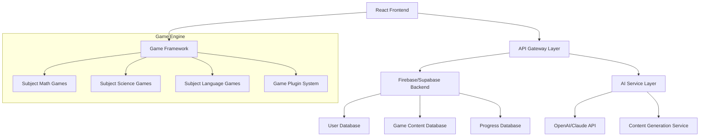

# 設計書

## 概要

個別最適AIラーニングゲーム・プラットフォームは、各科目のミニゲームを統一的に管理する共通基盤として設計されます。JavaScriptをベースとし、フロントエンドにReact、バックエンドにFirebase/Supabase、AI機能に生成AI APIを活用したモダンなWebアプリケーションアーキテクチャを採用します。

## アーキテクチャ

### システム構成図



### レイヤー構成

**プレゼンテーション層:**
- React 18 + JavaScript
- Tailwind CSS / Material-UI
- React Router for SPA navigation
- React Query for state management

**API層:**
- RESTful API design
- Firebase Functions / Supabase Edge Functions
- Authentication middleware
- Rate limiting and security

**ビジネスロジック層:**
- Game engine core
- AI personalization engine
- Progress tracking system
- Content management system

**データ層:**
- Firebase Firestore / Supabase PostgreSQL
- Real-time synchronization
- Offline-first architecture

**外部統合層:**
- OpenAI GPT-4 API
- Claude API (Anthropic)
- Content delivery network

## コンポーネントとインターフェース

### フロントエンドコンポーネント構成

```javascript
// 主要コンポーネント階層
src/
├── components/
│   ├── common/           // 共通コンポーネント
│   ├── auth/            // 認証関連
│   ├── dashboard/       // ダッシュボード
│   ├── games/           // ゲーム関連
│   ├── analytics/       // 分析・レポート
│   └── admin/           // 管理機能
├── hooks/               // カスタムフック
├── services/            // API通信
├── utils/               // ユーティリティ
├── constants/           // 定数定義
└── game-engine/         // ゲームエンジン
```

### ゲームエンジンアーキテクチャ

```javascript
// ゲームエンジンコア
class GameEngine {
  async loadGame(gameId) {
    // ゲーム読み込み処理
    return await this.gameRepository.findById(gameId);
  }
  
  startGame(game, userId) {
    // ゲームセッション開始
    return new GameSession(game, userId);
  }
  
  updateProgress(session, progress) {
    // 進捗更新処理
    session.updateProgress(progress);
    this.saveProgress(session);
  }
  
  adaptDifficulty(session, aiRecommendation) {
    // AI推奨に基づく難易度調整
    session.adjustDifficulty(aiRecommendation);
  }
}

// ゲーム基底クラス
class Game {
  constructor(config) {
    this.id = config.id;
    this.subject = config.subject;
    this.type = config.type;
    this.metadata = config.metadata;
    this.config = config.config;
  }
  
  render() {
    // React コンポーネントを返す
    return this.gameComponent;
  }
  
  onComplete(result) {
    // ゲーム完了時の処理
    this.handleGameResult(result);
  }
}

// AI パーソナライゼーションエンジン
class AIPersonalizationEngine {
  async analyzePerformance(userId, gameResults) {
    // パフォーマンス分析
    const analysisData = await this.processResults(gameResults);
    return this.generateLearningProfile(userId, analysisData);
  }
  
  async generateContent(profile, subject) {
    // AI コンテンツ生成
    return await this.aiService.generateContent({
      profile,
      subject,
      difficulty: profile.currentLevel
    });
  }
  
  async recommendGames(profile) {
    // ゲーム推奨
    return await this.recommendationService.getRecommendations(profile);
  }
  
  adaptDifficulty(currentLevel, performance) {
    // 難易度適応
    return this.difficultyAdapter.calculate(currentLevel, performance);
  }
}
```

### API設計

#### 認証・ユーザー管理API
```javascript
// ユーザー認証
POST /api/auth/login
POST /api/auth/register
POST /api/auth/logout
GET  /api/auth/profile

// ユーザー管理
GET  /api/users/:id
PUT  /api/users/:id
GET  /api/users/:id/progress
```

#### ゲーム管理API
```javascript
// ゲーム一覧・詳細
GET  /api/games
GET  /api/games/:id
GET  /api/games/subject/:subject

// ゲームセッション
POST /api/games/:id/start
PUT  /api/games/sessions/:sessionId
POST /api/games/sessions/:sessionId/complete
```

#### AI・パーソナライゼーションAPI
```javascript
// AI分析・推奨
POST /api/ai/analyze-performance
GET  /api/ai/recommendations/:userId
POST /api/ai/generate-content
PUT  /api/ai/update-profile
```

#### 分析・レポートAPI
```javascript
// 進捗分析
GET  /api/analytics/student/:id
GET  /api/analytics/class/:classId
GET  /api/analytics/reports/export
```

## データモデル

### ユーザーモデル
```javascript
// ユーザーデータ構造
const userSchema = {
  id: String,
  email: String,
  role: String, // 'student' | 'teacher' | 'parent' | 'admin'
  profile: {
    name: String,
    grade: Number,
    subjects: Array,
    learningStyle: String,
    aiProfile: Object
  },
  preferences: Object,
  createdAt: Date,
  updatedAt: Date
};

// ユーザークラス
class User {
  constructor(userData) {
    this.id = userData.id;
    this.email = userData.email;
    this.role = userData.role;
    this.profile = userData.profile;
    this.preferences = userData.preferences;
    this.createdAt = userData.createdAt;
    this.updatedAt = userData.updatedAt;
  }
  
  updateProfile(profileData) {
    this.profile = { ...this.profile, ...profileData };
    this.updatedAt = new Date();
  }
}
```

### ゲームモデル
```javascript
// ゲームデータ構造
const gameSchema = {
  id: String,
  title: String,
  subject: String,
  type: String,
  difficulty: Number,
  metadata: Object,
  content: Object,
  aiConfig: Object,
  status: String // 'active' | 'inactive' | 'draft'
};

// ゲームセッションデータ構造
const gameSessionSchema = {
  id: String,
  gameId: String,
  userId: String,
  startTime: Date,
  endTime: Date,
  progress: Object,
  results: Array,
  aiAdaptations: Array
};

// ゲームセッションクラス
class GameSession {
  constructor(game, userId) {
    this.id = this.generateId();
    this.gameId = game.id;
    this.userId = userId;
    this.startTime = new Date();
    this.progress = {};
    this.results = [];
    this.aiAdaptations = [];
  }
  
  updateProgress(progressData) {
    this.progress = { ...this.progress, ...progressData };
  }
  
  complete(finalResult) {
    this.endTime = new Date();
    this.results.push(finalResult);
  }
}
```

### 進捗・分析モデル
```javascript
// 学習進捗データ構造
const learningProgressSchema = {
  userId: String,
  subject: String,
  currentLevel: Number,
  skillMastery: Array,
  weakAreas: Array,
  strongAreas: Array,
  totalPlayTime: Number,
  gamesCompleted: Number,
  lastActivity: Date
};

// パフォーマンス分析データ構造
const performanceAnalyticsSchema = {
  userId: String,
  timeframe: String,
  metrics: Object,
  trends: Array,
  recommendations: Array
};

// 学習進捗クラス
class LearningProgress {
  constructor(userId, subject) {
    this.userId = userId;
    this.subject = subject;
    this.currentLevel = 1;
    this.skillMastery = [];
    this.weakAreas = [];
    this.strongAreas = [];
    this.totalPlayTime = 0;
    this.gamesCompleted = 0;
    this.lastActivity = new Date();
  }
  
  updateFromGameResult(gameResult) {
    this.gamesCompleted++;
    this.totalPlayTime += gameResult.playTime;
    this.lastActivity = new Date();
    this.analyzeSkills(gameResult);
  }
  
  analyzeSkills(gameResult) {
    // スキル分析ロジック
    if (gameResult.score > 0.8) {
      this.addStrongArea(gameResult.skillArea);
    } else if (gameResult.score < 0.5) {
      this.addWeakArea(gameResult.skillArea);
    }
  }
}
```

## エラーハンドリング

### フロントエンドエラー処理
```javascript
// エラーバウンダリ
class GameErrorBoundary extends React.Component {
  constructor(props) {
    super(props);
    this.state = { hasError: false, error: null };
  }
  
  static getDerivedStateFromError(error) {
    return { hasError: true, error };
  }
  
  componentDidCatch(error, errorInfo) {
    // エラーログ送信
    this.logError(error, errorInfo);
    console.error('Game Error:', error, errorInfo);
  }
  
  logError(error, errorInfo) {
    // エラー報告サービスに送信
    const errorData = {
      message: error.message,
      stack: error.stack,
      componentStack: errorInfo.componentStack,
      timestamp: new Date().toISOString()
    };
    
    // Firebase Analytics や外部サービスに送信
    this.sendErrorReport(errorData);
  }
  
  render() {
    if (this.state.hasError) {
      return (
        <div className="error-fallback">
          <h2>ゲームでエラーが発生しました</h2>
          <button onClick={() => this.setState({ hasError: false })}>
            再試行
          </button>
        </div>
      );
    }
    
    return this.props.children;
  }
}

// API エラーハンドリング
const handleApiError = (error) => {
  const errorCode = error.response?.data?.error?.code || error.code;
  
  switch (errorCode) {
    case 'GAME_NOT_FOUND':
      showNotification('ゲームが見つかりません', 'error');
      break;
    case 'AI_SERVICE_UNAVAILABLE':
      showNotification('AI機能が一時的に利用できません', 'warning');
      break;
    case 'NETWORK_ERROR':
      showNotification('ネットワークエラーが発生しました', 'error');
      break;
    case 'AUTHENTICATION_FAILED':
      showNotification('認証に失敗しました', 'error');
      // ログイン画面にリダイレクト
      window.location.href = '/login';
      break;
    default:
      showNotification('予期しないエラーが発生しました', 'error');
      console.error('Unhandled API Error:', error);
  }
};

// 通知表示関数
const showNotification = (message, type) => {
  // Toast通知やSnackbarで表示
  const notification = {
    message,
    type,
    timestamp: new Date().toISOString()
  };
  
  // 通知システムに送信
  window.dispatchEvent(new CustomEvent('showNotification', { 
    detail: notification 
  }));
};
```

### バックエンドエラー処理
```javascript
// 統一エラーレスポンス構造
const createErrorResponse = (code, message, details = null) => {
  return {
    success: false,
    error: {
      code,
      message,
      details
    },
    timestamp: new Date().toISOString()
  };
};

// カスタムエラークラス
class AppError extends Error {
  constructor(message, statusCode = 500, code = 'INTERNAL_ERROR') {
    super(message);
    this.statusCode = statusCode;
    this.code = code;
    this.isOperational = true;
    
    Error.captureStackTrace(this, this.constructor);
  }
}

// エラーミドルウェア
const errorHandler = (error, req, res, next) => {
  let statusCode = 500;
  let errorCode = 'INTERNAL_ERROR';
  let message = '内部エラーが発生しました';
  
  // カスタムエラーの場合
  if (error instanceof AppError) {
    statusCode = error.statusCode;
    errorCode = error.code;
    message = error.message;
  }
  
  // Firebase/Supabaseエラーの場合
  if (error.code === 'auth/user-not-found') {
    statusCode = 404;
    errorCode = 'USER_NOT_FOUND';
    message = 'ユーザーが見つかりません';
  }
  
  // バリデーションエラーの場合
  if (error.name === 'ValidationError') {
    statusCode = 400;
    errorCode = 'VALIDATION_ERROR';
    message = '入力データが無効です';
  }
  
  const errorResponse = createErrorResponse(errorCode, message, 
    process.env.NODE_ENV === 'development' ? error.stack : null
  );
  
  // エラーログ出力
  console.error(`[${new Date().toISOString()}] ${errorCode}: ${message}`, {
    url: req.url,
    method: req.method,
    userId: req.user?.id,
    stack: error.stack
  });
  
  res.status(statusCode).json(errorResponse);
};

// 非同期エラーキャッチャー
const asyncHandler = (fn) => {
  return (req, res, next) => {
    Promise.resolve(fn(req, res, next)).catch(next);
  };
};
```

## テスト戦略

### テスト構成
```javascript
// ユニットテスト (Jest)
describe('GameEngine', () => {
  let gameEngine;
  
  beforeEach(() => {
    gameEngine = new GameEngine();
  });
  
  test('should load game correctly', async () => {
    const game = await gameEngine.loadGame('math-001');
    expect(game).toBeDefined();
    expect(game.subject).toBe('mathematics');
    expect(game.id).toBe('math-001');
  });
  
  test('should start game session', () => {
    const mockGame = { id: 'test-game', subject: 'math' };
    const session = gameEngine.startGame(mockGame, 'user-123');
    
    expect(session).toBeInstanceOf(GameSession);
    expect(session.gameId).toBe('test-game');
    expect(session.userId).toBe('user-123');
  });
});

// React コンポーネントテスト (Jest + React Testing Library)
describe('GameComponent', () => {
  test('renders game interface correctly', () => {
    const mockGame = {
      id: 'math-001',
      title: '算数ゲーム',
      subject: 'mathematics'
    };
    
    render(<GameComponent game={mockGame} />);
    
    expect(screen.getByText('算数ゲーム')).toBeInTheDocument();
    expect(screen.getByRole('button', { name: /開始/ })).toBeInTheDocument();
  });
  
  test('handles game completion', async () => {
    const onComplete = jest.fn();
    const mockGame = { id: 'test-game' };
    
    render(<GameComponent game={mockGame} onComplete={onComplete} />);
    
    const startButton = screen.getByRole('button', { name: /開始/ });
    fireEvent.click(startButton);
    
    // ゲーム完了をシミュレート
    const completeButton = await screen.findByRole('button', { name: /完了/ });
    fireEvent.click(completeButton);
    
    expect(onComplete).toHaveBeenCalledWith(expect.objectContaining({
      gameId: 'test-game',
      completed: true
    }));
  });
});

// API統合テスト (Jest + Supertest)
describe('Game API', () => {
  test('GET /api/games should return games list', async () => {
    const response = await request(app)
      .get('/api/games')
      .set('Authorization', `Bearer ${testToken}`)
      .expect(200);
    
    expect(response.body.success).toBe(true);
    expect(Array.isArray(response.body.data)).toBe(true);
  });
  
  test('POST /api/games/:id/start should create game session', async () => {
    const response = await request(app)
      .post('/api/games/math-001/start')
      .set('Authorization', `Bearer ${testToken}`)
      .expect(200);
    
    expect(response.body.success).toBe(true);
    expect(response.body.data.sessionId).toBeDefined();
  });
});

// AI サービステスト
describe('AIPersonalizationEngine', () => {
  let aiEngine;
  
  beforeEach(() => {
    aiEngine = new AIPersonalizationEngine();
  });
  
  test('should analyze performance correctly', async () => {
    const mockResults = [
      { score: 0.8, skillArea: 'addition', playTime: 120 },
      { score: 0.6, skillArea: 'subtraction', playTime: 180 }
    ];
    
    const profile = await aiEngine.analyzePerformance('user-123', mockResults);
    
    expect(profile.userId).toBe('user-123');
    expect(profile.strongAreas).toContain('addition');
    expect(profile.currentLevel).toBeGreaterThan(0);
  });
  
  test('should recommend appropriate games', async () => {
    const mockProfile = {
      userId: 'user-123',
      currentLevel: 2,
      weakAreas: ['multiplication'],
      strongAreas: ['addition']
    };
    
    const recommendations = await aiEngine.recommendGames(mockProfile);
    
    expect(Array.isArray(recommendations)).toBe(true);
    expect(recommendations.length).toBeGreaterThan(0);
    expect(recommendations[0]).toHaveProperty('gameId');
    expect(recommendations[0]).toHaveProperty('reason');
  });
});

// E2Eテスト (Playwright)
describe('Game Playing Flow', () => {
  test('student can complete a full game session', async () => {
    // ログイン
    await page.goto('/login');
    await page.fill('[data-testid="email"]', 'student@example.com');
    await page.fill('[data-testid="password"]', 'password123');
    await page.click('[data-testid="login-button"]');
    
    // ダッシュボードに移動
    await expect(page).toHaveURL('/dashboard');
    
    // ゲーム選択
    await page.click('[data-testid="math-games"]');
    await page.click('[data-testid="game-math-basics"]');
    
    // ゲーム開始
    await page.click('[data-testid="start-game"]');
    await expect(page.locator('[data-testid="game-interface"]')).toBeVisible();
    
    // ゲームプレイ（簡単な問題を解く）
    await page.fill('[data-testid="answer-input"]', '5');
    await page.click('[data-testid="submit-answer"]');
    
    // 結果確認
    await expect(page.locator('[data-testid="game-result"]')).toBeVisible();
    await page.click('[data-testid="finish-game"]');
    
    // 進捗確認
    const progress = await page.textContent('[data-testid="games-completed"]');
    expect(parseInt(progress)).toBeGreaterThan(0);
  });
  
  test('teacher can view student progress', async () => {
    // 教師としてログイン
    await page.goto('/login');
    await page.fill('[data-testid="email"]', 'teacher@example.com');
    await page.fill('[data-testid="password"]', 'password123');
    await page.click('[data-testid="login-button"]');
    
    // 生徒一覧に移動
    await page.click('[data-testid="students-menu"]');
    await expect(page).toHaveURL('/students');
    
    // 特定の生徒を選択
    await page.click('[data-testid="student-john-doe"]');
    
    // 進捗データが表示されることを確認
    await expect(page.locator('[data-testid="progress-chart"]')).toBeVisible();
    await expect(page.locator('[data-testid="skill-analysis"]')).toBeVisible();
    
    // レポートエクスポート
    await page.click('[data-testid="export-report"]');
    const downloadPromise = page.waitForEvent('download');
    const download = await downloadPromise;
    expect(download.suggestedFilename()).toContain('.pdf');
  });
});
```

### テストカバレッジ目標
- **ユニットテスト**: 85%以上
- **統合テスト**: 主要APIエンドポイント100%
- **E2Eテスト**: 主要ユーザーフロー100%

### パフォーマンステスト
- ゲーム読み込み時間: 2秒以内
- AI推奨生成時間: 5秒以内
- 同時接続ユーザー: 1000人以上
- データベースクエリ応答: 100ms以内